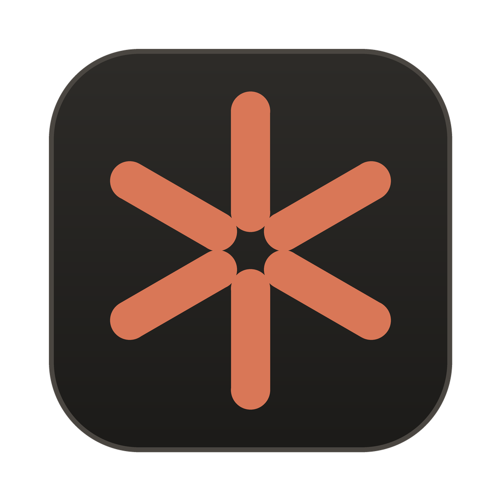
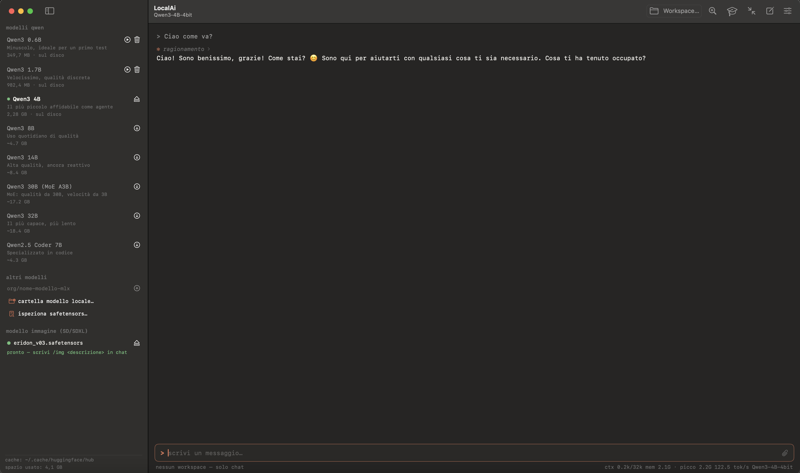
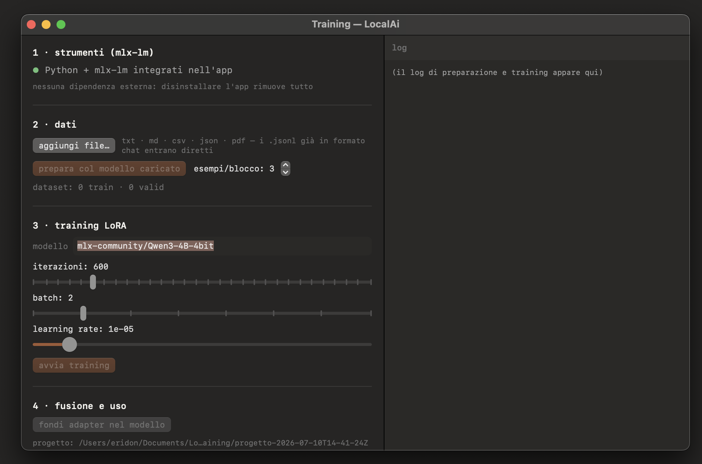
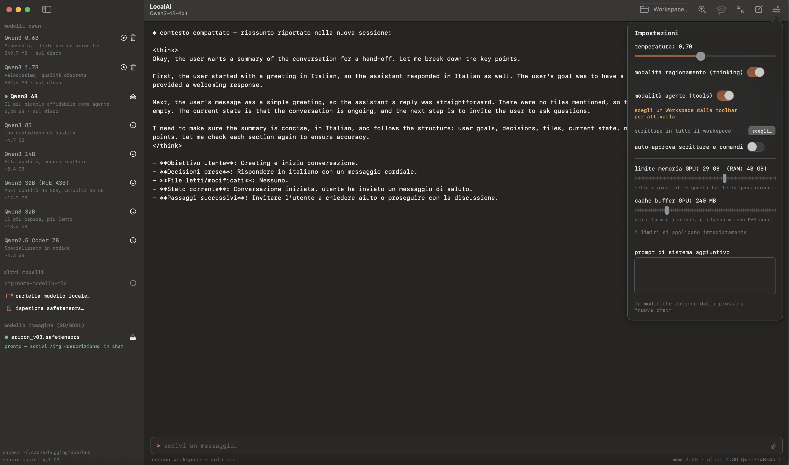

<p align="center">
  
</p>

<h1 align="center">LocalAi</h1>

<p align="center">
  <b>La tua AI completa, tutta sul tuo Mac.</b><br/>
  Chat, agente di coding, RAG sui documenti, fine-tuning e generazione immagini —<br/>
  nessun cloud, nessun abbonamento, nessun dato che lascia il computer.
</p>

<p align="center">
  
  
  
  
</p>

---

## Cos'è

**LocalAi** è un'app macOS nativa che porta un intero stack di intelligenza artificiale in locale su Apple Silicon, dentro un'unica app autonoma. Sotto il cofano usa **MLX** (il framework ML di Apple) per l'inferenza dei modelli linguistici Qwen e GLM, **mlx-lm** per il fine-tuning e la conversione, e **diffusers** per generazione e training di immagini — con un runtime Python integrato nel bundle: installi trascinando l'app, disinstalli cestinandola.

L'interfaccia riprende lo stile del terminale di Claude Code: tema scuro, font mono, accento arancione, input col prompt `>`, tool call come righe `⏺ tool(...)` con risultato `⎿` espandibile, ragionamento `✻` ripiegabile e approvazioni inline.

## Le sette anime dell'app

| | Funzione | In breve |
|---|---|---|
| 💬 | **Chat** | modelli **Qwen** 0.6B→32B e **GLM-4.7 Flash** in streaming, thinking ripiegabile, blocchi di codice con copia/salva, allegati (txt·md·csv·json·pdf) trascinabili |
| 🛠 | **Agente** | stile Claude Code: 8 tool confinati al workspace (read/write/edit/glob/grep/bash/search), approvazioni, memoria di progetto `LOCALAI.md`, `/compact`, confine di scrittura per cartella |
| 🔍 | **RAG** | indice semantico dei tuoi documenti (embedding multilingue), l'agente cerca per significato e cita le fonti |
| 🎓 | **Training testo** | fine-tuning LoRA/QLoRA: importi file grezzi, l'AI prepara il dataset, alleni, fondi e carichi in chat |
| 🖼 | **Training immagini** | LoRA SDXL stile DreamBooth (una cartella di immagini + parola-trigger) → LoRA montabile in `/img` e compatibile con ComfyUI |
| 🚀 | **Converti & Esporta** | qualsiasi modello HF → MLX (4/8-bit); modelli fusi in fp16 per vLLM/TGI, GGUF per Ollama/llama.cpp |
| 🎨 | **Immagini** | monti un checkpoint SD/SDXL single-file (anche da ComfyUI) e generi con `/img` — parametri regolabili (passi, dimensioni, guidance, seed, LoRA), anteprima in chat e salvataggio |

Aggancia anche **altri modelli MLX** (Llama, Mistral, Gemma, Phi, DeepSeek…) per id Hugging Face o cartella locale, e ispeziona qualsiasi `.safetensors` per sapere cos'è prima di montarlo.

## Screenshot

<p align="center">
  <br/>
  <em>Chat in stile terminale: streaming, ragionamento, modelli gestiti dalla sidebar</em>
</p>

<p align="center">
  <br/>
  <em>Training LoRA in 4 passi: dati → preparazione AI → training → fusione ed export</em>
</p>

<p align="center">
  <br/>
  <em>Impostazioni: limiti GPU, modalità agente, confine di scrittura — e compattazione del contesto</em>
</p>

## Avvio rapido

```sh
git clone https://github.com/edhima/LocalAi.git
cd LocalAi
./run.sh          # compila, crea LocalAi.app e la apre
```

Requisiti: macOS 14+ su Apple Silicon, Xcode (con Metal Toolchain: `xcodebuild -downloadComponent MetalToolchain`, una tantum). La prima build scarica e integra il runtime Python nel bundle; le successive sono rapide. Poi trascina **LocalAi.app** in /Applications.

> `run.sh` usa `xcodebuild` perché `swift build` non compila gli shader Metal di MLX. In alternativa: `open Package.swift` e Run da Xcode.

Primo utilizzo: scegli **Qwen3 4B** dalla sidebar (⬇️ ~2,3 GB) → chatta. Poi scegli un **Workspace** e prova la modalità agente: *"trova tutti i TODO nel progetto"*.

## Modelli e training

- **Catalogo**: Qwen3 (0.6B→32B, incluso il MoE 30B) e **GLM-4.7 Flash** — i migliori come agenti sono il Qwen3 30B MoE e GLM-4.7 Flash. Aggancia altri modelli MLX per id HF o cartella locale.
- **Converti in MLX** (finestra Training): qualsiasi checkpoint HF completo → cartella MLX quantizzata 4/8-bit, pronta per chat e training.
- **Training LoRA testo** (🎓 in sidebar): importi documenti, l'AI genera il dataset chat, alleni con `mlx_lm.lora`, fondi ed esporti (fp16 per vLLM, GGUF per Ollama).
- **Training LoRA immagini** (🎓 sotto il modello immagine): una cartella di foto + una parola-trigger inventata → LoRA SDXL su GPU Metal (~1,6 passi/s a 512px), montabile in `/img`. Il dataset viene ripulito da solo (file nascosti e non-immagine scartati). Usa questa funzione **solo con soggetti per cui hai il diritto**: te stesso, persone che ti hanno dato consenso, i tuoi prodotti, personaggi inventati.

## Protezioni

Un LLM locale senza freni può saturare la RAM: LocalAi ha un tetto rigido di memoria GPU (configurabile, default 60% della RAM — oltre, la generazione fallisce con un errore invece di bloccare il Mac), limite alla cache MLX, massimo 4096 token per risposta e massimo 30 tool call per turno. L'agente legge solo nel workspace, scrive solo dove autorizzi, e chiede conferma per ogni scrittura e comando shell.

## Architettura

| Target / File | Ruolo |
|---|---|
| `QwenLocalCore/AgentToolbox.swift` | gli 8 tool dell'agente, confinati al workspace |
| `QwenLocalCore/ModelCatalog.swift` | catalogo curato dei modelli Qwen |
| `LocalAi/QwenEngine.swift` | caricamento modelli, sessioni, streaming, dispatch tool + approvazioni |
| `LocalAi/RAGManager.swift` | indice semantico (MLXEmbedders) e ricerca per coseno |
| `LocalAi/TrainingManager.swift` | pipeline fine-tuning testo + conversione HF→MLX, runtime integrato |
| `LocalAi/ImageGenManager.swift` | worker diffusers persistente su Metal per SD/SDXL (con LoRA e parametri) |
| `LocalAi/ImageTrainingManager.swift` | training LoRA SDXL stile DreamBooth su MPS |
| `LocalAi/SafetensorsInspector.swift` | identificazione di qualsiasi file .safetensors |
| `LocalAi/ChatView.swift` + `Theme.swift` | UI stile terminale Claude Code |
| `QwenSmoke/Smoke.swift` | smoke test end-to-end (`./run.sh smoke`) |

Librerie: [mlx-swift-lm](https://github.com/ml-explore/mlx-swift-lm) · [mlx-swift](https://github.com/ml-explore/mlx-swift) · [swift-huggingface](https://github.com/huggingface/swift-huggingface) · [swift-transformers](https://github.com/huggingface/swift-transformers) · [mlx-lm](https://github.com/ml-explore/mlx-lm) · [diffusers](https://github.com/huggingface/diffusers)

## Cosa resta sul disco (oltre all'app)

Solo dati dell'utente: i modelli scaricati (`~/.cache/huggingface/hub`, eliminabili dalla sidebar), i progetti di training (`~/Documents/LocalAiTraining`), le immagini generate (`~/Documents/LocalAiImages`) e lo stack immagini opzionale (`~/Library/Application Support/LocalAi`, rimovibile dall'app).

## Autore

**Eridon Dhima** · [Alpha Soft](mailto:e.dhima@alpha-soft.al) — contatti completi nel pannello *Informazioni su LocalAi* dell'app.
